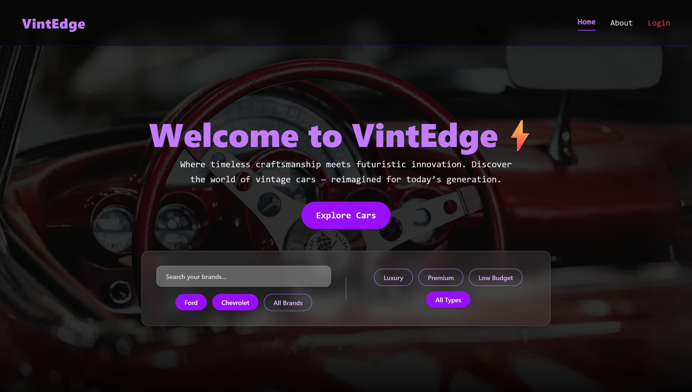

# VintEdge – Vintage Car Showcase

VintEdge is a modern, responsive web application built with **React** and **React Router DOM**. It showcases vintage cars with detailed specifications, pricing, photos, and admin functionalities. The project demonstrates routing, nested routes, and responsive UI using **TailwindCSS**.

---

## 🚀 Features

### User-Facing

- **Home Page:** Stunning hero section with a responsive banner slider.
- **Home Page Filters:**  
  A **filter set integrated directly on the Home page** allowing users to:
  - Filter cars by **Brand**
  - Filter cars by **Type**
  - Instantly refine results from the front screen
- **Car Listings:** Browse vintage cars with essential specs.
- **Car Details:** View individual car details, pricing, and photo gallery.
- **About Page:** Learn about the mission and offerings.
- **Contact Page:** Send messages via a contact form.

### Admin Panel

- **Admin Dashboard:** Overview of total cars, total income, and total reviews.
- **Income Page:** Track car-wise income with monthly breakdown.
- **Car Management:** View and manage cars with details, pricing, and photos.
- **Reviews Section:** Read and manage reviews.
- **Responsive Layout:** Works on desktop, tablet, and mobile screens.

---

## 🛠 Tech Stack

- **Frontend:** React, React Router DOM
- **Styling:** TailwindCSS
- **State Management:** React Context API
- **Other Libraries:**
  - `react-helmet` – For dynamic page titles.
  - `react-slick` – For banner slider on the homepage.

---

## 📸 Screenshots

- 

---

## 🔗 Routing Overview

### Public Routes

- `/` → Home (with Brand & Type Filters)
- `/about` → About
- `/contact` → Contact
- `/cars` → Product (Cars List)
- `/cars/:id` → ProductDetails

### Admin Routes

- `/admin` → AdminDashboard
- `/admin/income` → AdminIncome
  - `/admin/income/:id` → AdminIncomeChart
- `/admin/allcars` → AdminCars
  - `/admin/allcars/:id` → AdminCarsSingle
    - `/dashboard` → AdminCarDetails (Index Route)
    - `/pricing` → AdminCarPricing
    - `/photos` → AdminCarPhotos
- `/admin/review` → AdminReview

---

## 📱 Responsiveness

- Fully mobile-friendly layout across all pages.
- Responsive **banner slider** optimized for mobile and large screens.
- Home page filter set adapts smoothly to all screen sizes.
- Admin panel secondary navbar collapses on smaller screens.
- TailwindCSS utility classes used extensively for responsive layouts.

---

## 🔗 Demo Link

[Live Demo](https://vintedge.sreeramraghu.online/)
